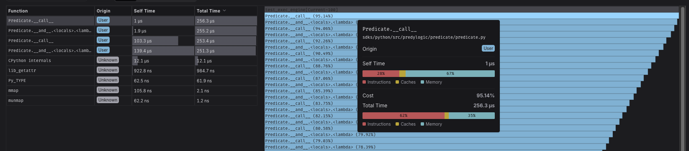
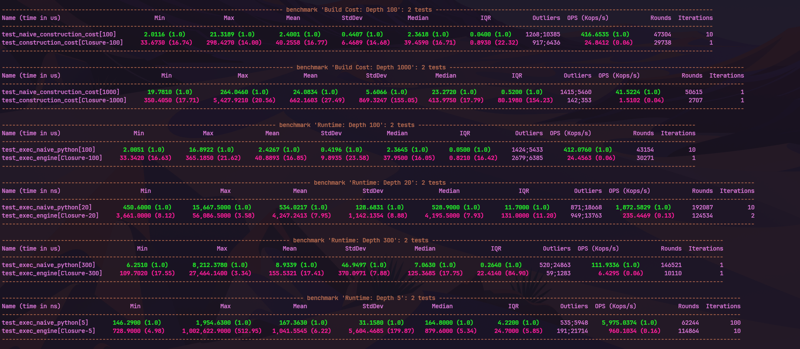

# Architecture Decision: Evaluation Engine

## Context

Initial implementations utilized a Recursive Closure Pattern for composing predicate logic.
While syntactically elegant and easy to implement, profiling at scale revealed critical structural deficiencies in
Python's execution model.

This document details the rationale for migrating to an **Iterative AST Engine**.

## Diagnosis: The Closure Trap

Profiling against deep rule chains (`depth > 100`) exposed three fatal flaws in the closure-based approach.

#### 1. Stack Frame Overhead

Python's interpreter incurs significant overhead for every function call (`PUSH_FRAME`/`POP_FRAME`).

- **Observation:** CPU profiling shows execution time is dominated by stack management rather than actual logic
  evaluation.
- **Impact:** A logic chain of depth 2,000 creates a call stack of depth 2,000. This hits the `sys.getrecursionlimit()`
  wall immediately and degrades performance non-linearly due to CPU cache misses.

> The vast majority of the time is spent waiting for the closure to return.
??? info "Expand/Collapse: CPU Profile"
    

> Below is a skyscraper
??? info "Expand/Collapse: CPU Profile"
    

> Additionally, a RecursionError will occur when predicate nesting exceeds the current stack depth limit (though this is highly unlikely to occur in production).

#### 2. Memory Fragmentation & GC Instability

Closures are opaque objects that hold references to their execution context (cells).

Observation: Benchmarks reveal extreme standard deviation (StdDev) in execution times at high depths.

Impact: Constructing deep chains triggers aggressive Garbage Collection (GC) cycles due to the massive number of
temporary callable objects. This results in unpredictable latency spikes (P95 outliers).

[Open memory flamegraph (HTML)](../assets/closure_mem_flamegraph.html)

#### 3. Zero Introspection (The "Black Box")

Compiled closures are opaque to the runtime.

Problem: A composed predicate is simply `<function <lambda> at 0x...>` .

Impact: Impossible to debug. When a rule evaluates to False, we cannot trace which specific node failed or inspect the
intermediate state of the logic chain without intrusive logging hacks.

---

## Solution: The AST Pattern

We replaced the recursive execution model with an explicit **Iterative AST Engine**.

### Design Principles

1. **Reify Logic as Data:** Rules are defined as data structures (Nodes), not compiled functions.
2. **Iterative Evaluation:** A single loop processes the tree.
3. **Separation of Schema and State:** The rule structure is immutable; execution state is transient.

### Benefits
| Feature              | Closure (Legacy)           | AST Engine (Current)                     |
|----------------------|----------------------------|------------------------------------------|
| **Control Flow**     | Recursive Call Stack       | `while` Loop / Stack Machine             |
| **Space Complexity** | Stack Frames               | Stack Frames (Heap only)                 |
| **Stability**        | High Jitter (GC thrashing) | Deterministic / Linear                   |
| **Debuggability**    | None (Opaque)              | **Full Introspection** (Visitable Nodes) |

### Conclusion

The transition to an AST-based engine allows us to support arbitrarily complex rule chains with **linear performance
characteristics** and **constant stack usage**, while enabling features like serialization and step-through debugging
that were impossible under the closure model.
