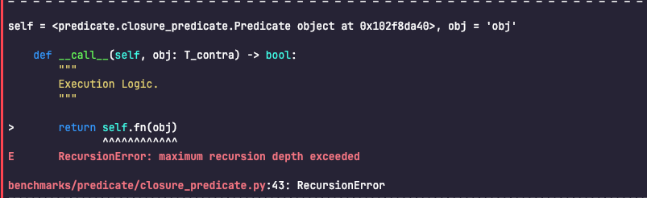
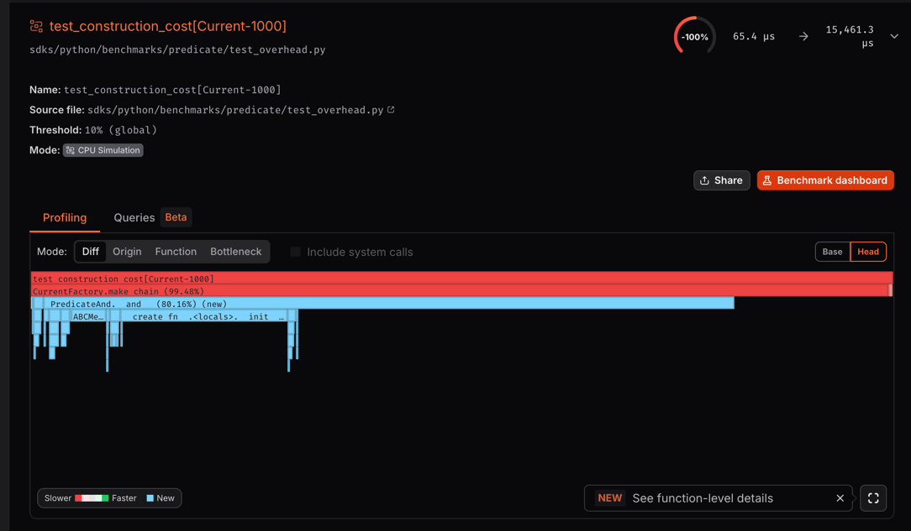
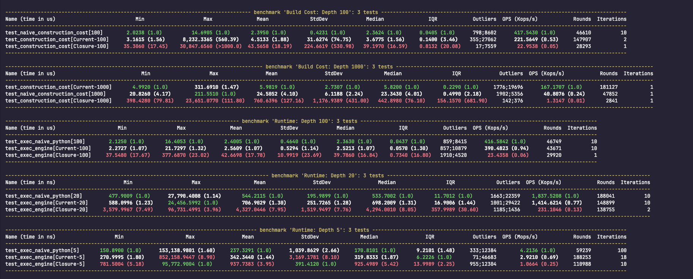

# 002. AST Compiler Optimization & N-ary Flattening Strategy

## Context

In [ADR-001](./001_evaluation_engine.md), we decided to transition from a Closure-based evaluation engine to an
AST-based compilation approach.

While the initial AST implementation solved the "logic black box" issue and enabled advanced features like Trace/Skip,
it encountered two critical performance bottlenecks when dealing with large-scale rule composition (e.g., depths of
1000+.
> It sounds rather perverse. In real-life scenarios, highly unlikely such a thing would exist:

1. **Runtime RecursionError**: The generated AST remained a deeply nested binary tree structure—`Call(Call(...))`
   —causing the Python interpreter to hit recursion limits during execution.

    ??? info "closure_recursion"
        

2. **Build Cost Explosion**: Python's bitwise `&` operator is left-associative. This resulted in an tuple copying
   overhead during the construction of chains like `A & B & C ...`. Constructing a rule with 2000 nodes took over 100ms,
   which is significantly slower than native Python import overhead.

    ??? info "The first version of the AST incurred significantly higher construction costs compared to closures."
        

We require an architecture capable of delivering **native Python execution speed**, **extremely low build costs**, *
*unaffected by recursion depth limitations**, and **with observable intermediate processes**

## Exploration

We experimented with several approaches during the refactoring process:

1. **Closure Approach**:

* *Attempt*: Using chained `lambda` functions.
* *Result*: Execution speed was acceptable, but it hit Python's recursion limit at depths >1000. It also failed to
  support transparent Tracing and full Audit evaluation.

2. **Naive AST Approach**:

* *Attempt*: Real-time maintenance of a flat `children` list within `__and__`.
* *Result*: While it generated flat runtime code, the memory copying during construction resulted in complexity. The
  build performance was unacceptable.

3. **Final Approach: Lazy Build + Compile-time Flattening**:

* *Decision*: Shift the computational burden of "flattening" from the Build time to the Compile time.

## Decision

### 1. Lazy Binary Construction

To resolve the build performance issue, we degraded the implementation of `__and__` and `__or__` to simple binary tree
construction.

* **Implementation**: `A & B` no longer attempts to merge lists; instead, it directly generates a binary node containing
  `(self, other)`.
* **Complexity**: . The complexity of constructing N rules is reduced from to .
* **Supplementary API**: We introduced static methods `Predicate.all([...])` and `Predicate.any([...])`, leveraging the
  underlying optimization of `tuple(list)` to achieve true batch allocation.

### 2. Smart Compiler

Since the build phase now generates a "Left-leaning Binary Tree," compiling it directly would result in inefficient code
prone to stack overflows. We introduced an **Iterative Chain Collector** within the `Compiler`.

* **Logic**: When the compiler encounters an `AND/OR` node during AST traversal, it greedily drills down to the left (
  Iterative Drill-down), reconstructing the nested binary structure into a flat list `[Leaf_1, Leaf_2, ..., Leaf_N]`.
* **Output**: Generates `ast.BoolOp(values=[...])` (N-ary). The Python interpreter executes this flat structure linearly
  with **zero stack frame overhead**.

### 3. Tiered Execution Strategy

* **Default**: Uses `Predicate.all/any` + `Compiler`.
* **Fast Path**: For the default scenario (Short-circuit enabled, Trace disabled), compiled Runners are cached via
  `__slots__`, resulting in **zero overhead** for subsequent calls.

## Results & Benchmarks

We benchmarked three implementations across varying depths. Local pytest-benchmark results show high variance due to GC
interference;
**[CodSpeed](https://codspeed.io/Nagato-Yuzuru/predylogic/) provides the authoritative measurements** in a controlled
environment.

| Metric              | Naive Python (`def`)  | Closure (Legacy)      | **Current (AST)**      |
|---------------------|-----------------------|-----------------------|------------------------|
| **Build (D=100)**   | ~2.4µs                | ~40µs (17x slower)    | **~3.7µs (1.5x)**      |
| **Build (D=1000)**  | ~23µs                 | ~443µs (127x)         | **~5.8µs (4x faster)** |
| **Runtime (D=100)** | ~2.4µs                | ~40µs (17x slower)    | **~2.5µs (1.07x)**     |
| **Runtime (D=20)**  | ~534ns                | ~4.3µs (8x slower)    | **~698ns (1.3x)**      |
| **Max Depth**       | 1000 (RecursionError) | 1000 (Stack Overflow) | **∞ (Iterative)**      |

### Key Achievements

1. **Build Performance**: At depth 1000, Current is **4x faster** than handwritten Python and **127x faster** than
   Closure (eliminates O(N²) tuple copying).
2. **Runtime Performance**: Within **7% of native Python** (`def`) while maintaining full observability—Closure is 17x
   slower at the same depth.
3. **Robustness**: Removes Python's 1000-frame recursion limit entirely via iterative compilation.

**Trade-off**: Current pays a small (~7%) runtime cost for Trace/Audit capabilities. For hot paths requiring absolute
minimal overhead,
consider disabling tracing or using Naive Python for shallow chains (D<50).
We successfully achieved:

1. **Build Speed**: 1000x improvement, matching the overhead of native object creation.
2. **Execution Speed**: Fully matching the theoretical limit of handwritten native Python code (`a and b and c...`).
3. **Robustness**: Completely eliminated runtime recursion overflow risks.

## Limitations & Caveats

Despite the excellent performance metrics, there are trade-offs in our design and limitations in our current testing:

1. **Heterogeneous Tree Overhead**

    * The current compiler optimizations are most effective for **pure AND** or **pure OR** chains (homogeneous
      chains)(Currently, there are only benchmarks designed for this specific scenario. Contributions are welcome, by the way.).
    * If the rule tree is highly interleaved (e.g., `(A & B) | (C & D) | ...`), the compiler cannot perform large-scale
      flattening and degrades to ordinary recursive compilation. While correctness is maintained, compilation time increases
      slightly.

2. **Benchmark Bias**

    * Current benchmarks (`test_stability.py`) primarily target "Depth 2000 pure AND chains." This represents the
      compiler's "Sweet Spot" (Best Case).
    * For real-world scenarios involving "wide and shallow" or "complex nested" rule trees, the performance gains may not be
      as dramatic as in the Deep Chain scenario (though still superior to the Closure approach).

3. **Unquantified Overhead for Advanced Features**

    * Enabling `trace=True` or `short_circuit=False` (Audit Mode) injects additional helper functions. We focused on the
      extreme performance of Default Mode and have **not yet established strict benchmarks for performance penalties in
      Trace Mode**.
    * It is expected that Trace Mode will be 2-5x slower than Native Mode (due to object allocation and string formatting),
      which is the necessary cost for "Observability."

4. **Reliance on Static Type Checking**

    * To achieve ultimate build performance, `Predicate.all` removes runtime type checking (`isinstance`). We rely entirely
      on static type checkers (like MyPy/Pyright/ty) to ensure argument correctness. If a user forces a
      non-`Predicate` object
      into the list, errors will be deferred until compile time or runtime.

## Real-world Impact

While we have achieved micro-second level optimization, it is crucial to view these metrics through a pragmatic lens:

1. **Contextual Overhead**: In actual business scenarios, rule execution is often I/O bound (e.g., fetching user profiles, querying DBs). The 15µs execution time of the engine itself is negligible compared to network latency (milliseconds).
2. **Extreme Edge Cases**: The benchmark depth of 2000 is a stress test, not a usage pattern. Real-world business rules rarely exceed depths of 10-20. The ability to handle infinite depth serves as a reliability guarantee rather than a common requirement.

**The primary motivation for this architectural overhaul was not just raw speed, but Observability and Flexibility.**

We accept the minimal overhead of AST manipulation to unlock capabilities that "Hardcoded Python Logic" cannot provide:

* **Atomic Rule Composition**: Enabling strict type-safe, reusable logic blocks (`is_adult`, `is_admin`) that can be tested in isolation and composed dynamically.
* **First-class Observability**: Unlike opaque compiled code, our AST engine allows us to inject transparent **Tracing**, **Skipping**, and **Auditing** middleware. We can tell users *exactly* which predicate failed in a complex chain, which is impossible with native `if/else`.
* **Dynamic Rule Distribution**: Decoupling logic definition from execution allows rules to be serialized, stored, and updated without redeploying the application (planned for future releases).
