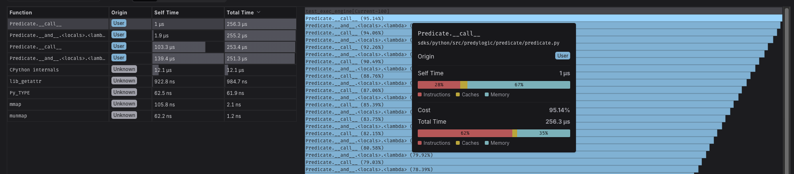
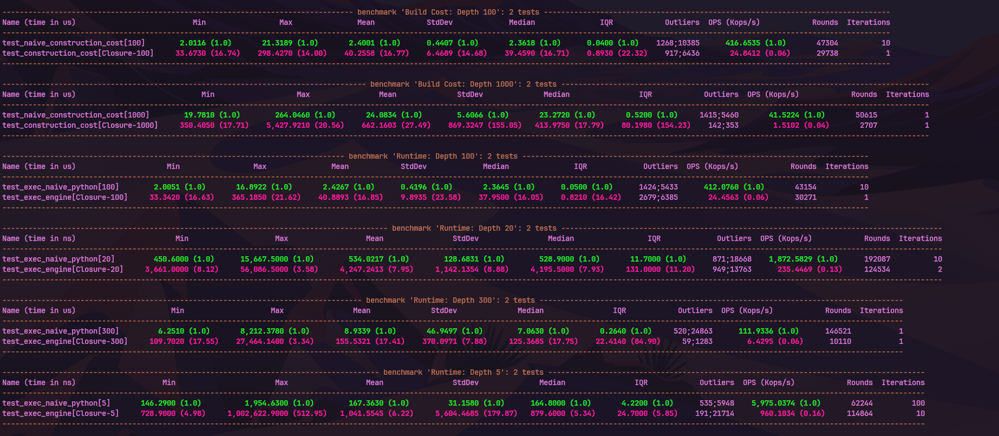

# Architecture Decision: Evaluation Engine

## Context

We started with a recursive closure pattern for composing predicate logic. It was syntactically clean and easy to implement, but profiling against deep rule chains exposed structural problems in Python's execution model.

This document records why we moved to an **Iterative AST Engine**.

## Diagnosis: The Closure Trap

Profiling against deep rule chains (`depth > 100`) exposed three problems in the closure-based approach.

#### 1. Stack Frame Overhead

Python's interpreter incurs significant overhead for every function call (`PUSH_FRAME`/`POP_FRAME`).

CPU profiling shows execution time dominated by stack management, not actual logic evaluation. A chain of depth 2,000 creates a call stack of depth 2,000, hitting `sys.getrecursionlimit()` immediately and degrading performance non-linearly from CPU cache misses.

> The vast majority of the time is spent waiting for the closure to return.
??? info "Expand/Collapse: CPU Profile"
    

> Below is a skyscraper
??? info "Expand/Collapse: CPU Profile"
    

Predicate nesting past the stack depth limit also triggers `RecursionError`, though this is unlikely in production.

#### 2. Memory Fragmentation & GC Instability

Closures are opaque objects that hold references to their execution context (cells).

Benchmarks show extreme standard deviation in execution times at high depths.

Constructing deep chains triggers aggressive GC cycles from the large number of temporary callable objects, producing unpredictable latency spikes (P95 outliers).

[Open memory flamegraph (HTML)](../assets/closure_mem_flamegraph.html)

#### 3. Zero Introspection (The "Black Box")

Compiled closures are opaque to the runtime.

A composed predicate is just `<function <lambda> at 0x...>`. When a rule evaluates to `False`, there is no way to trace which node failed or inspect intermediate state without intrusive logging.

---

## Solution: The AST Pattern

We replaced the recursive execution model with an explicit **Iterative AST Engine**.

### Design Principles

1. Rules are defined as data structures (nodes), not compiled functions.
2. A single loop processes the tree.
3. The rule structure is immutable; execution state is transient.

### Benefits
| Feature              | Closure (Legacy)           | AST Engine (Current)                     |
|----------------------|----------------------------|------------------------------------------|
| **Control Flow**     | Recursive Call Stack       | `while` Loop / Stack Machine             |
| **Space Complexity** | Stack Frames               | Stack Frames (Heap only)                 |
| **Stability**        | High Jitter (GC thrashing) | Deterministic / Linear                   |
| **Debuggability**    | None (Opaque)              | **Full Introspection** (Visitable Nodes) |

### Conclusion

The transition to an AST-based engine lets us support arbitrarily complex rule chains with **linear performance characteristics** and **constant stack usage**, while enabling serialization and step-through debugging that were impossible under the closure model.
