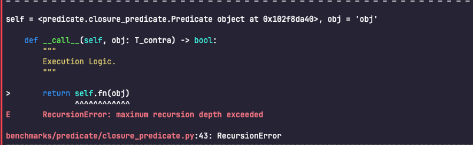
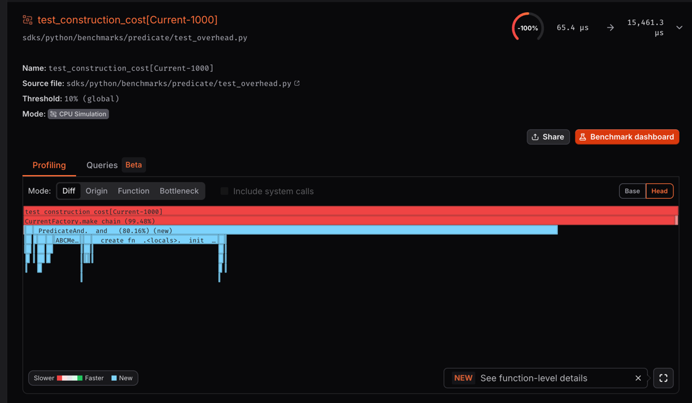
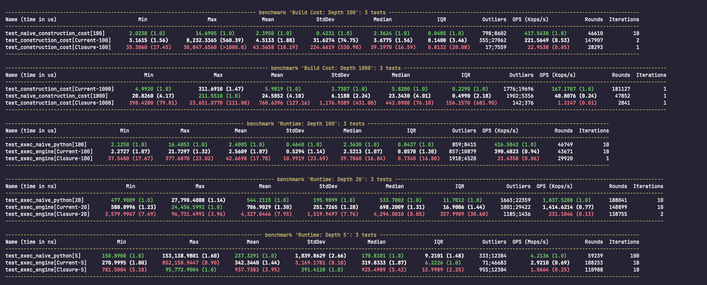

# 002. AST Compiler Optimization & N-ary Flattening Strategy

## Context

In [ADR-001](./001_evaluation_engine.md), we decided to transition from a Closure-based evaluation engine to an
AST-based compilation approach.

While the initial AST implementation solved the "logic black box" issue and enabled advanced features like Trace/Skip,
it hit two performance bottlenecks at large-scale rule composition (e.g., depths of 1000+).

> It sounds rather perverse. In real-life scenarios, highly unlikely such a thing would exist:

1. Runtime `RecursionError`: the generated AST was a deeply nested binary tree—`Call(Call(...))`—causing the interpreter to hit recursion limits during execution.

??? info "closure_recursion"

    

2. Build cost explosion: Python's `&` is left-associative, causing tuple-copying overhead when building `A & B & C ...`. A 2000-node rule took over 100ms to construct, significantly slower than native Python import overhead.

??? info "The first version of the AST incurred significantly higher construction costs compared to closures."

    

We need an architecture that delivers native Python execution speed, extremely low build cost, no recursion depth limit, and observable intermediate state.

## Exploration

We tried several approaches:

1. **Closure approach**: chained `lambda` functions. Execution speed was fine, but it hit Python's recursion limit at depths >1000 and couldn't support transparent Tracing or full Audit evaluation.

2. **Naive AST approach**: maintaining a flat `children` list in `__and__` at build time. Generated flat runtime code, but the memory copying during construction was unacceptable.

3. **Lazy build + compile-time flattening**: shift the flattening burden from build time to compile time. This is the current approach.

## Decision

### 1. Lazy Binary Construction

To resolve the build performance issue, we degraded `__and__` and `__or__` to simple binary tree construction.

`A & B` no longer tries to merge lists; it creates a binary node `(self, other)` directly. Each `&` drops from O(N) (tuple copying) to O(1) (binary node allocation), so an N-rule chain builds in O(N) not O(N²). We also added `Predicate.all([...])` and `Predicate.any([...])` as static methods that use `tuple(list)` internally for true batch allocation.

### 2. Smart Compiler

Since the build phase now generates a "left-leaning binary tree," compiling it directly would produce inefficient, stack-overflow-prone code. We introduced an **Iterative Chain Collector** in the `Compiler`.

When the compiler encounters an `AND/OR` node, it greedily drills left (iterative drill-down), reconstructing the nested binary structure into a flat list `[Leaf_1, Leaf_2, ..., Leaf_N]`. The output is `ast.BoolOp(values=[...])` (N-ary), which the interpreter executes linearly with **zero stack frame overhead**.

### 3. Tiered Execution Strategy

The default uses `Predicate.all/any` + `Compiler`. For the default scenario (short-circuit on, Trace off), compiled Runners are cached via `__slots__`, so subsequent calls have **zero overhead**.

## Results & Benchmarks

We benchmarked three implementations across varying depths. Local pytest-benchmark results show high variance due to GC
interference;
**[CodSpeed](https://codspeed.io/Nagato-Yuzuru/predylogic/) provides the authoritative measurements** in a controlled
environment.

| Metric              | Naive Python (`def`)  | Closure (Legacy)      | **Current (AST)**      |
| ------------------- | --------------------- | --------------------- | ---------------------- |
| **Build (D=100)**   | ~2.4µs                | ~40µs (17x slower)    | **~3.7µs (1.5x)**      |
| **Build (D=1000)**  | ~23µs                 | ~443µs (127x)         | **~5.8µs (4x faster)** |
| **Runtime (D=100)** | ~2.4µs                | ~40µs (17x slower)    | **~2.5µs (1.07x)**     |
| **Runtime (D=20)**  | ~534ns                | ~4.3µs (8x slower)    | **~698ns (1.3x)**      |
| **Max Depth**       | 1000 (RecursionError) | 1000 (Stack Overflow) | **∞ (Iterative)**      |

### Key Achievements

At depth 1000, the current implementation builds **4x faster** than handwritten Python and **127x faster** than the closure approach (eliminating O(N²) tuple copying). Runtime lands within **7% of native Python** (`def`) while maintaining full observability — the closure approach is 17x slower at the same depth. Iterative compilation removes Python's 1000-frame recursion limit entirely.

**Trade-off**: the current approach pays a small (~7%) runtime cost for Trace/Audit capabilities. For hot paths requiring minimal overhead, consider disabling tracing or using naive Python for shallow chains (D<50).

## Limitations & Caveats

Despite the performance gains, there are trade-offs in the design and gaps in the current test coverage:

1. Heterogeneous tree overhead. Compiler optimizations work best on pure AND or pure OR chains (current benchmarks only cover this case — contributions welcome). Mixed trees like `(A & B) | (C & D) | ...` degrade to ordinary recursive compilation; correctness is maintained but compile time increases slightly.

2. Benchmark bias. Current benchmarks (`test_stability.py`) target depth-2000 pure AND chains — the compiler's sweet spot. Wide, shallow, or complex nested trees won't see gains as dramatic, though they remain better than the closure approach.

3. Unquantified overhead for advanced features. Enabling `trace=True` or `short_circuit=False` injects additional helper functions. We haven't benchmarked Trace Mode rigorously, but expect it to run 2–5x slower than Default Mode due to object allocation and string formatting — the necessary cost of observability.

4. Static type checking reliance. To maximize build performance, `Predicate.all` removes runtime type checking (`isinstance`). We rely entirely on static type checkers (mypy/pyright/ty) to catch argument errors. A non-`Predicate` object forced into the list will surface at compile time or runtime, not at the call site.

## Real-world Impact

In real business scenarios, rule execution is typically I/O-bound (fetching user profiles, querying databases). The engine's 15µs execution time is negligible against network latency. The benchmark depth of 2000 is a stress test; real business rules rarely exceed 10–20 levels, and infinite-depth support is a reliability guarantee, not a daily requirement.

The primary motivation for this work was observability and flexibility, not raw speed. We accept the small overhead of AST manipulation to unlock capabilities that hardcoded Python logic cannot provide: type-safe reusable rule blocks (`is_adult`, `is_admin`) that can be tested in isolation, transparent Tracing and Auditing middleware that tells you exactly which predicate failed, and rules that can be serialized and updated without redeploying (planned for a future release).
